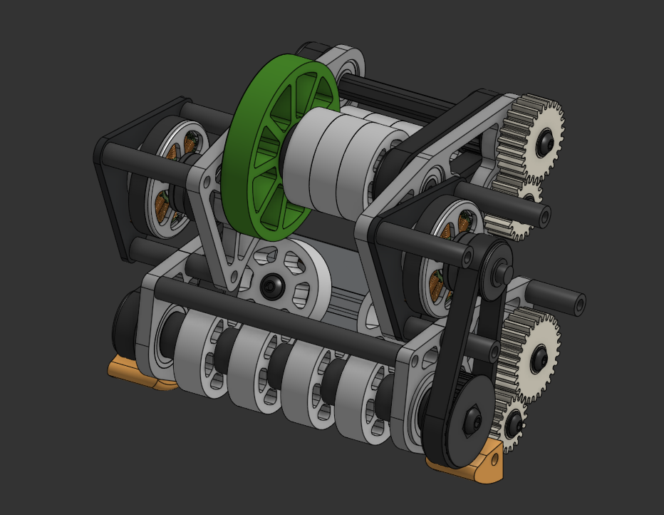

## 10/22/2025 - Restarting an Old project
I've had multiple attempts at building a rival robot, many of which came into fruition but never had enough time to be tuned and refined. This includes Tonkotsu V1 and Tonkotsu V2 which had all the CAD and actual physical build but the swerve drive made it difficult to run well. With UDON, I plan to take a step back and build an easier mecanum drive. Here's what I'm thinking:

Not great, I know but the mechanism can be changed. I want to base this off NCR rivals bot but as a shooter design instead of an arm that they had. Beginning to work on the mecanum drive here:

I think this is a great start, I'm banking on the fact that I can also borrow the GoBilda mecanum wheels from my local FTC team :D

Time Spent: 5 Hours

## 10/23/2025 - Intake!
I've thought about many ways to do the intake, with a shuttlecock being such an oriented-based gamepiece, the head has to go forward at all times for this to work. I tried to figure out a passive way of intaking but none seems as reliable as having 2 centering wheels. 

I'm quite proud of the centering wheels using bevel gear tech, it just looks so good.

Time Spent: 4 Hours

## 10/24/2025 - Shooter Done :P
Finally, I found a way to fit in this shooter. The packagagine is quite tough and I am slightly worried over the flywheels expanding when it is shooting. I think this is good enough. One other thing is that the green wheel is used for silo dumping but it might get in the way of the shuttlecock, I have to prototype to find out.

Time Spent: 3.5 Hours

## 10/25/2025
Watching back some of the old games from Orange County Maker Fair and Tidal Tumble, EDF seems like the way to go. The EDF blows the shuttlecocks to the otherside and since the floor is a point, that is a LOT of points that can be gained that way. I added one to the robot too but I think it needs a cover because in one of the matches, I saw a shuttlecock go into it and it just exploded.

It looks really good but now I have to go back and redesign where I am going to put my electronics. I planned to put it where the EDF is (in the back of the robot) but with that space gone, I might have to add a plate so that I can just put the electronics on the top of the bot. This isn't really ideal because I liked the idea of a flat tanky robot but oh wells.

Time Spent: 1.5 Hours

## 10/26/2025
So I'm looking into ways to cut costs and especially ways to manufacture those side plates. I 3D printed the intake and shooter plates and if I get rid of the pocketing, they seem well strong enough to hold up. The outside mecanum plates are non-negotiable and have to be aluminum 6061. I checked in with my FRC team that I work with and the router is open to use but they are missing clamp plates and haven't even used it once yet. As of now, I'm leading towards using Fabworks. Checking their pricing, its $150 even on the cheapest shipping option (ouch!). We'll see what I go with but that is seeming much more likely.

Time Spent: 1 Hour