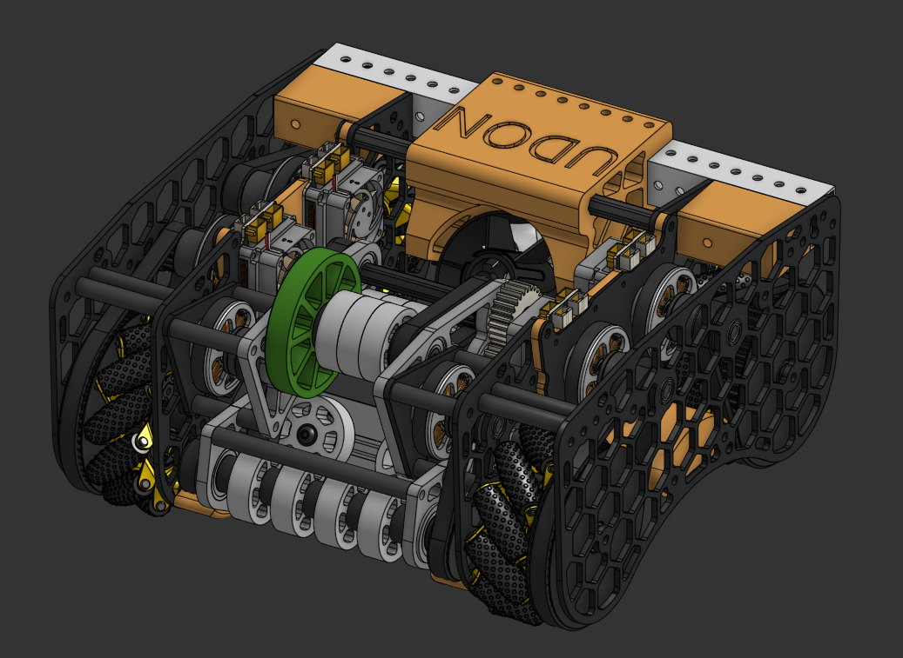
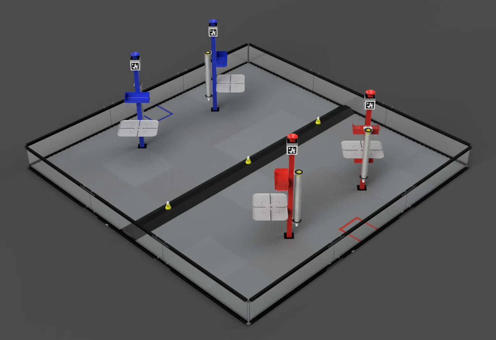
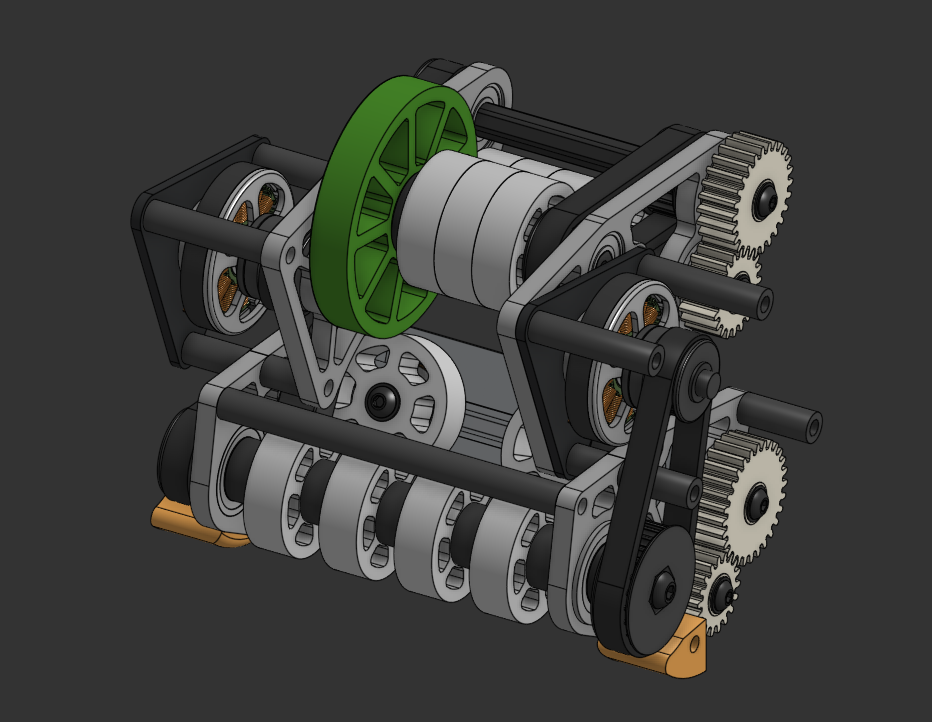
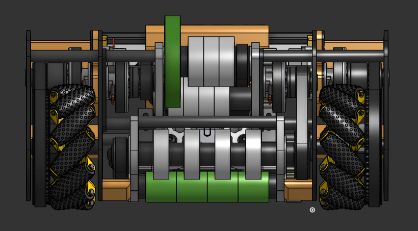
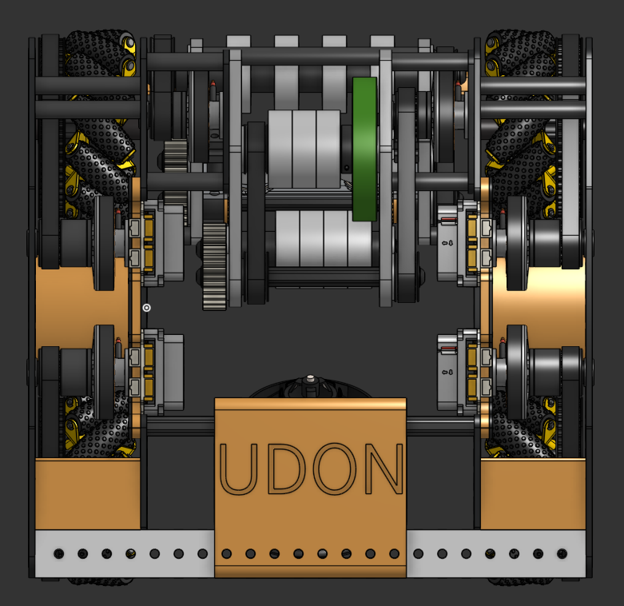

# UDON V2 | Rivals Robotics Competition
UDON V2 ISO Picture:

Onshape Link:
https://cad.onshape.com/documents/64d3a7b3a5a997c633685ba5/w/7495e428fcc4a5cb4c65dc9c/e/3e5da57740d178980547a374 

Feel free to make a copy and use it as a base for your robot!

## Rival Robotics
RIVAL Robotics Competition is a robotics competition for all ages targeted at advanced builders. There are multiple events with a different challange each year. For more information, visit https://www.rivalrobotics.co/

## Overview
UDON V2 is a shooter robot meant to compete in the Rival Robotics Competition. Its main goal is to shoot missiles (badminton shuttlecock) onto platforms on the goal post.

<table>
  <tr>
    <td valign="top" width="80%">
      
    </td>
    <td valign="top">
        Image of the Rival Robotics "DOOMSDAY" Field
    </td>
  </tr>
</table>

This robot intakes the missiles off the ground to shoot it up into the L2 platforms. It also has the ability to "silo dump" or drop all the missiles out of the tube. The EDF on the back of the robot allows for large area "acquisition" of the missiles and blow it to the other side.

Intake/Shooter Mechanism:

### Why?
UDON V2 was created in order to explore further levels of advanced robotics. Coming from an FRC and Robotics background, UDON acts as a way to build and learn skills as well as grow the RIVAL community. Tonkotsu Tech, the overarching group overseeing UDON, has made contributions to RIVALS and wishes to continue that through UDON.

## Pictures:

## Control System
UDON V2 is based off the moteus control system (https://mjbots.com/) which is a high precision control system with the Raspberry Pi 4 at its core. 

- Raspberry Pi 4
- pi3Hat r4.5
- moteus-r4 Motor Controller
    - Controls 6 5010 Brushles Motors
- mjpower-ss

## Bill of Materials List: